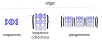
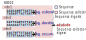

{ width="300" align=right }

# Refget specifications

## What is refget?

Refget is a set of GA4GH standards for identifying and distributing reference biological sequences.
It consists of these standards:

| Standard      | Description                          | Status |
| ----------- | ------------------------------------ | |
| [Refget sequences](sequences.md)      | For individual sequences  | :white_check_mark: v1.0 Approved in 2021  :white_check_mark:&nbsp;v2.0&nbsp;Approved in 2024 |
| [Refget sequence collections](seqcol.md)      | For collections of sequences | :white_check_mark: v1.0 Approved in 2025 |
| Refget pangenomes  | For collections of sequence collections | :fontawesome-solid-gears: Currently in process |

## What is the main purpose of the refget project?

Refget standards help to **identify**, **retrieve**, and **compare** reference sequences, like a reference genome. Key principles include:

- Reference data, including sequences and collections of sequences, are identified using cryptographic digest-based identifiers that are **derived from the data itself**. This allows reference data to be identified without requiring a centralized accessioning authority.
- Refget standards can be used for any type of sequences: DNA, RNA, protein, etc -- anything that can be represented as a string of characters.
- Refget standards also specify **retrieval APIs**, providing a mechanism for retrieving a sequence or collection if you have its identifier.
- Refget sequence collections also provides a programmatic approach to assessing compatibility among sequence collections.

For more information about use cases, see the [use cases section of the sequence collections specification](seqcol.md#use-cases).

## How do the standards work together?

<figure>

</figure>

The Refget Sequences standard is used by the Sequence Collections standard, and the Sequence Collections standard forms the basis of the Pangenomes standard.
First, sequences are digested to yield a deterministic identifier.
These sequence identifiers are then used, together with their names, to create an identifier for a collection.

<figure>

</figure>
